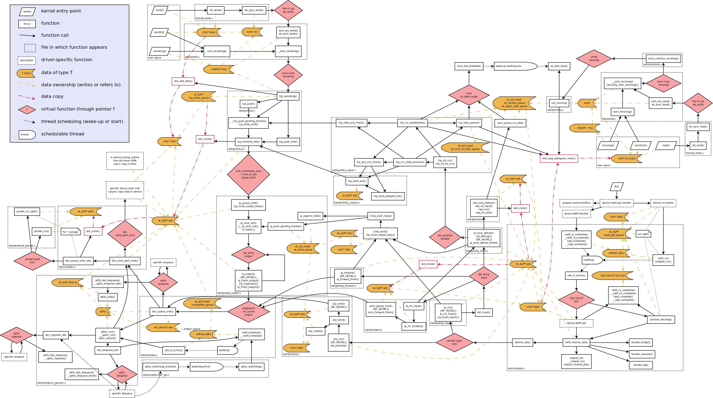

# Network Data Flow through Kernel

# Resources

[https://openwrt.org/docs/guide-developer/networking/praxis](https://openwrt.org/docs/guide-developer/networking/praxis) \
[http://www.jsevy.com/network/Linux_network_stack_walkthrough.html](http://www.jsevy.com/network/Linux_network_stack_walkthrough.html) \
[https://www.dpdk.org/about/](https://www.dpdk.org/about/) \
[High-end Linux based Open Router for IP QoS networks](./high-end_Linux_based_Open_Router_for_IP_QoS_networ.pdf) \
[An In-Kernel Solution Based on XDP for 5G UPF: Design, Prototype and Performance Evaluation](./xdp_for_5g.pdf) \
[Fast Packet Processing with eBPF and XDP](./fast_packet_ebpf_xdp.pdf) \
[NAPI](https://lwn.net/Articles/30107/)