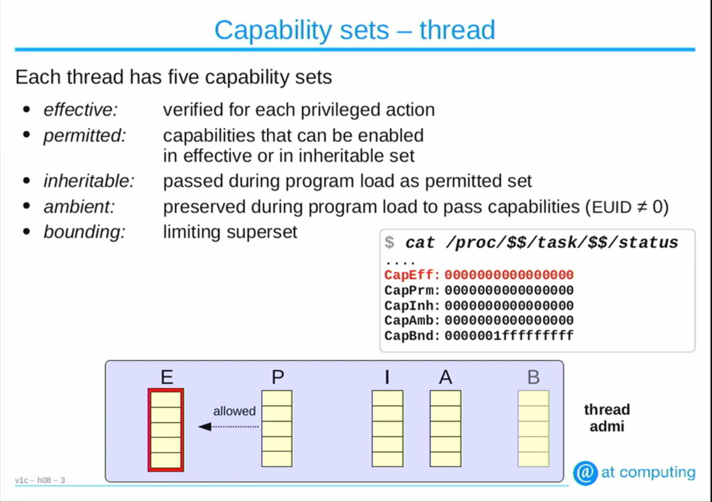
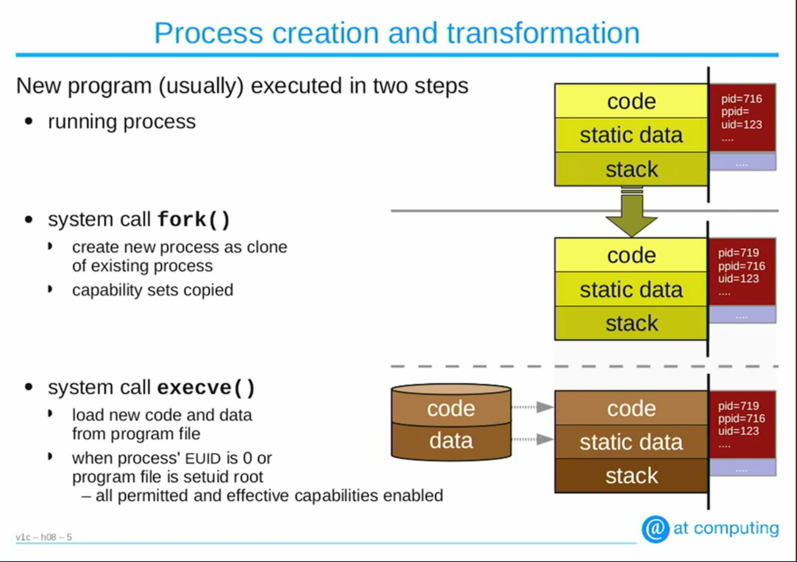
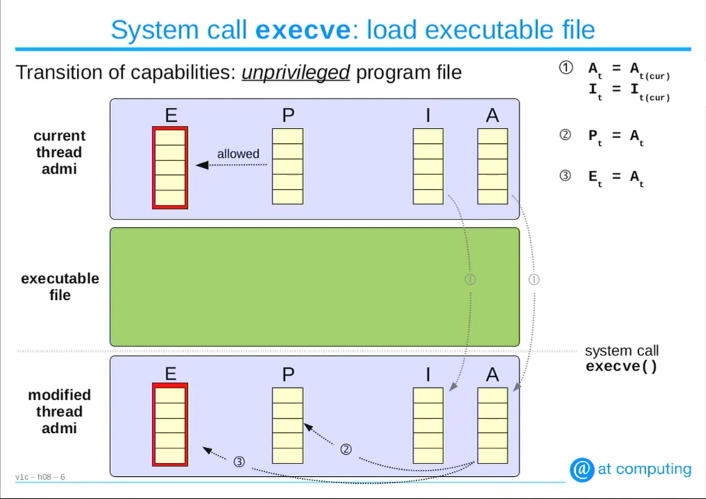
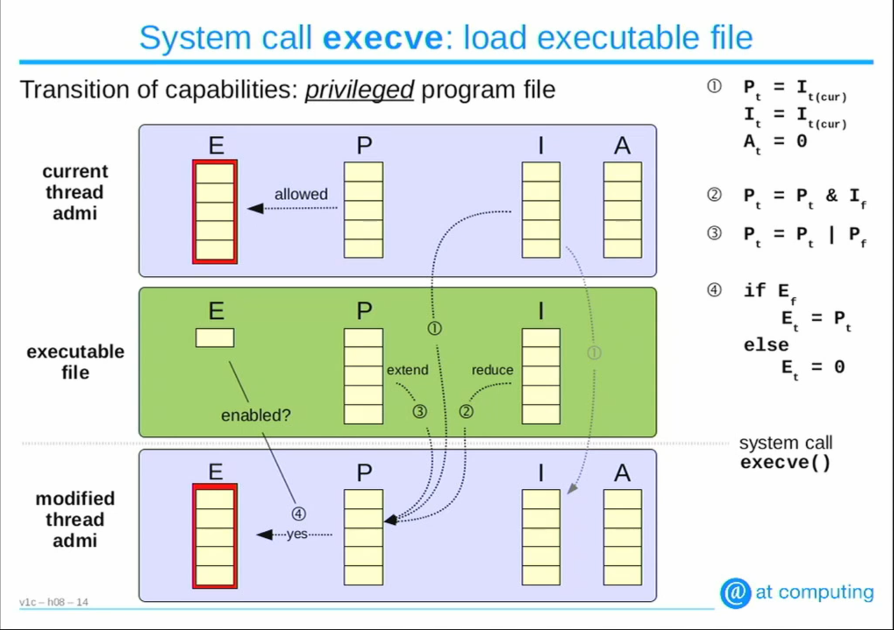

## ToDo

- Containers
- Capabilities and Namespaces

# Capabilities

Any process that runs with the EUID ( Effective User ID ) = 0 is given all the privileges in Linux.<br>
This creates a lot of issues. For example : to allow a program to create raw scokets, we need to give it root privileges. This can be done either by running the program as `sudo` or `setting the SUID bit`. The problem with this method is that apart from the capability to raw sockets it gets access to other capabilities too, like changing the system time, changing mount properties, chaning ownership, etc. This creates a great security concern, where applications may harm the system.<br><br>

So to tackle with the Linux divides the root privileges into various capabilities like CAP_SYS_BOOT for boot privileges, CAP_KILL to allow the calling process(thread) the ability to kill process, etc.<br><br>

To get a complete list of capabilities, see `man 7 capabilities`.

## Types of Capabilities

Each thread has 5 capability sets:
- effective : verified for each privileged action 
- permitted : capabilities that can be enabled in effective/inheritable set
- inheritable : passed during program load (exec) as permitted set
- ambient : preserved duriing program load to pass capabilities (EUID != 0)
- bounding : limiting superset

To view capabilites / capability_sets supported by a process(thread) : `cat /proc/<pid>/task/<pid or thread_id>/status` <br>
To view the capabilities of the current shell run : `cat /proc/$$/task/$$/status`
```bash
....
CapInh:	0000000000000000
CapPrm:	0000000000000000
CapEff:	0000000000000000
CapBnd:	000001ffffffffff
CapAmb:	0000000000000000
....
```



## On `execve()` 



### For unprivileged file

- The ambient list is copied through loading.
- The ambient capabilities of the calling process becomes the permitted and the effective capabilities of the loaded program.
- If the bounding set is limited, then even if the ambient capability allow more capabilities, it is bounded according to the bounded set.



### For privileged file

- The inherited list is copied first, then it is ANDed (Bitwise AND) with the Permitted list of the process calling execve.
- Then the ANDed list is ORed with Permitted list of the executable file.
- If the Effective bits are set in the executable files, then the Effective bits are set in the loading process.



- prctl()
<pre>
Manipulates various behaviour of processes and threads.
Should be used with care
Use cases :
	+ Reads or changes the ambient capability set of the calling thread.
	+ Check if the capability specified in  arg2  is  in  the calling  thread's capability bounding set. The capability bounding set dictates whether the process can receive the capability through a file's permitted capability set on a subsequent call to execve(2).
	+ If the calling thread has the capability `CAP_SETPCAP` capability within its user namespace, then allow it to drop capabilitites given as argument.
	+ Set or get the "child subreaper" attribute of the calling process. A subreaper fulfills the role of init(1) for  its  descendant  processes. When a process becomes orphaned (i.e., its immediate parent terminates), then that process will be reparented to the nearest still living ancestor  subreaper. 
	+ Set or get the "endian-ness" of the calling process
	+ Set or get the name of the calling thread
	+ And much more
</pre>
See : `man 2 prctl`

- libpcap/libcap : capabilities commands and library
- getpcap/setpcap : commands for capabilities info

# Cgroups

# Namespaces

Feature that provides processes their own view of the system and its resources and isolates independent processes from each other. They are represented as files under `/proc/<pid>/ns` directory.

When a new process is spawned, it inherits the namespace of its parent.

There are 6 types of namespaces:
- PID Namespace
- NET Namespace
- MNT Namespace
- UTS Namespace
- IPC Namespace
- USER Namespace
- CGROUP Namespace


